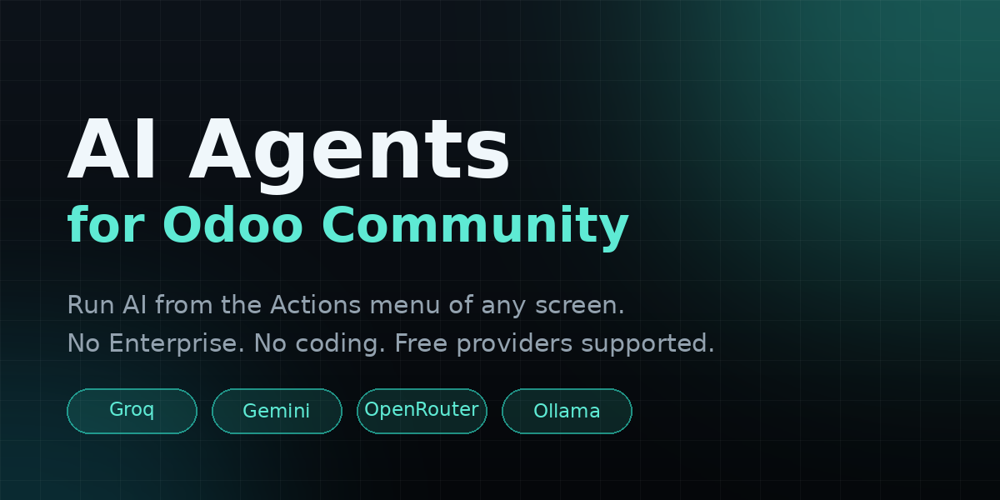

# AI Agents for Odoo Community

**Odoo 19 keeps its AI features for Enterprise. This app brings them to Community.**

Create an AI agent in a few clicks and run it from the **Actions** menu of *any* screen in
Odoo - Sales, CRM, Products, HR, Helpdesk, or your own custom models. No coding, no developer
mode, and it works with free AI providers.



---

## Why this exists

Odoo 19 added AI across the whole system - but only for Enterprise. Community users, who make
up the larger part of the install base, got nothing. This module fills that gap using AI
providers you choose yourself, including several that are completely free.

## What you can do with it

| Example agent | Runs on | Result goes to |
|---|---|---|
| Write a product description | Products | The sales description field |
| Summarise this lead | CRM leads | The chatter |
| Draft a reply to this ticket | Helpdesk | Shown for review first |
| Turn these notes into a job ad | Recruitment | The job description |

Anything you can describe in a sentence, on any model in your database.

## Setup in three minutes

1. **Install the module.** Go to **AI -> Configuration -> Providers**.
2. **Pick a provider.** Groq, Google Gemini, OpenRouter and Ollama are already configured -
   paste your API key and press **Test Connection**.
3. **Create an agent** under **AI -> Agents**: choose where it runs, describe the task in plain
   English, tick the fields the AI may see, and choose what happens to the answer.

Your agent now appears in the ⚙ **Actions** menu of those records.

### Getting a free API key

| Provider | Cost | Where to get a key |
|---|---|---|
| **Groq** | Free key | <https://console.groq.com/keys> |
| **Google Gemini** | Free tier | <https://aistudio.google.com/apikey> |
| **OpenRouter** | Free models available | <https://openrouter.ai/keys> |
| **Ollama** | Free, runs locally | <https://ollama.com/download> - no key needed |
| OpenAI | Paid | <https://platform.openai.com/api-keys> |
| Anthropic (Claude) | Paid | <https://console.anthropic.com/settings/keys> |

## Built to be safe with your data

- **Nothing is overwritten behind your back.** By default every result is shown to you first,
  so you can edit it before anything is saved.
- **Only the fields you tick are sent.** Nothing else leaves your database.
- **API keys are administrator-only.** Staff can run agents without ever seeing your keys.
- **Everything is logged** - what was sent, what came back, and how long it took.
- **Works fully offline.** Point it at Ollama and no data leaves your machine.

## Requirements

- Odoo 16.0, 17.0, 18.0 or 19.0 (Community or Enterprise)
- The Python `requests` library, which ships with Odoo

## Compatibility

| Odoo series | Status |
|---|---|
| 19.0 | ✅ Tested - installs clean, all tests pass |
| 18.0 | 🚧 Backport in progress |
| 17.0 | 🚧 Backport in progress |
| 16.0 | 🚧 Backport in progress |
| 15.0 | ❌ Not supported |

## Running the tests

```bash
odoo -d <db> -i ai_agent_hub --test-enable --test-tags=/ai_agent_hub \
     --stop-after-init --without-demo=all
```

The tests patch the network call, so no API key or internet connection is needed.

## License

LGPL-3. See [LICENSE](LICENSE).

---

Built by **Zarki** - <https://github.com/zarkidev>
